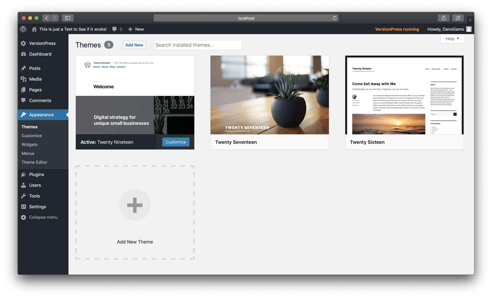
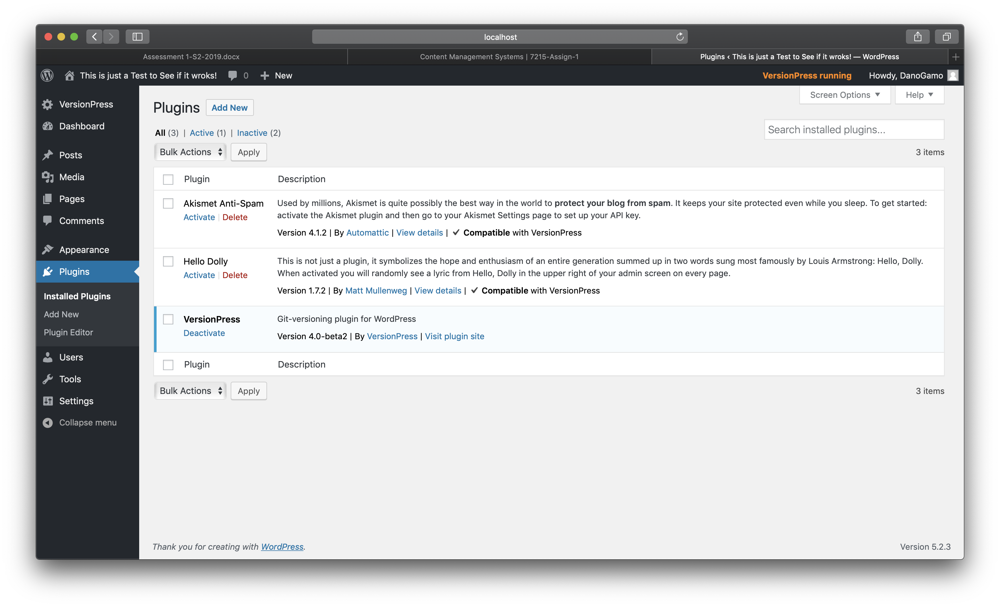
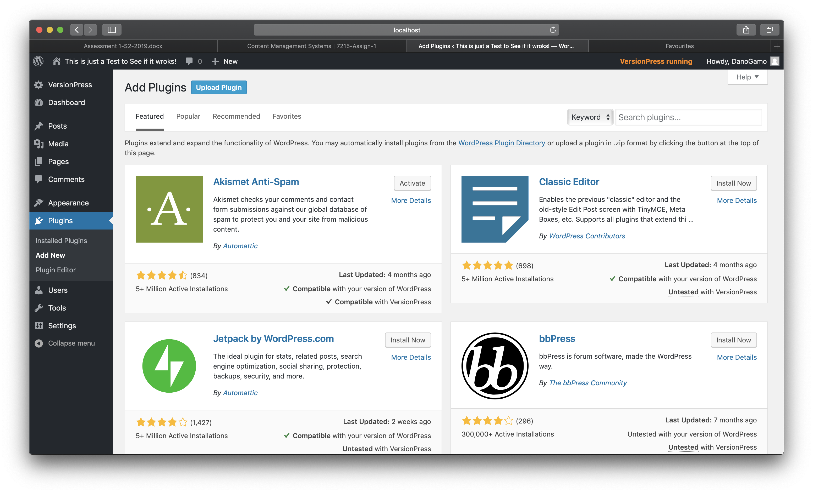

## Wordpress

Wordpress was born from the desire for an elegant, well-architectured personal publishing system

# CMS Installation

### Pre-Setup

Installing Wordpress is quite straight forward and pretty easy to do if you have a docker installed. Docker allows you to pull Wordpress straight down onto your local machine and start developing in no time. All of the downloading and setup is all done through the terminal so make sure that is open.

To Install Docker if you haven't got it installed Click <a href="https://docs.docker.com/docker-for-windows/install/">Here</a>

If you are on Windows you should install Git Bash, its by far the best and easiest Terminal to use on Windows: To download Git Bash Click <a href="https://git-scm.com/downloads">Here</a>

**_Note:_** _Keep the same terminal open at all times to make installation easier_

I'll be using the term **Terminal** this is to either reference Git Bash for Windows or Terminal for macOS.

### Installation Process

**_Note:_** _This process is far easier on a Apple Computer running macOS. Its actually better if you through your Windows PC away and buy a Mac!_

Go to https://github.com/Dayne-Game/Wordpress-Demo and fork the respository.

Once you have forked the repository copy the url (of your forked repository, not the link above), open up your terminal navigate to your desktop using the command `cd ~/Desktop` and type in the command `git clone <repository url>` and wait for the repo to be cloned onto your desktop.

Once the repo is cloned navigate into the folder uisng the same terminal. To do so type the command: `cd Wordpress-Demo`

Once you're inside the **Wordpress-Demo** folder via terminal type in the command `docker-compose up -d` now you have wordpress installed and running! Go to https://localhost:8080 and create your account and get started with wordpress!

### Acquiring and Installing a Theme

Here is a Video showing how to acquir and install a theme in Wordpress!

<video width="650" height="340" controls>
  <source src="Videos/Theme.mp4" type="video/mp4">
</video>

To change the theme of your Wordpress website you will need to be in the admin section of the website.

**Standard Steps of Changing your Theme**

When you are in the admin side (Dashboard) of your Wordpress website, you want to click on the word **Appearance** on the left sidebar at about halfway down from the top.

When you click on **Appearance** a new page will load (show) by default will display the themes section, where you can change your theme.

In this Theme's Section you can add new themes, which allows you to search through Wordpress database for free and or paid themes that you can build your site on.

To change your current theme you just need to select the one you want to change to and click **Activate** its that easy!

## Adding / Installing a Plug-in

Installing a plugin is pretty much the same process that you do for installing a theme in Wordpress.

First of all make sure that your are in the admin side of your Wordpress website, and click on the button on the left navigation bar called **Plugins**.

You see the list of your currently installed plugins. To add a new Plugin in click on the **Add New** button that takes you to another screen that allows your to browse different plugins that you can install. You can also upload a plugin thats is a .zip file to Wordpress.

## How to Produce a Simple Site

Heres a Video of a Quick CUstomization of the Header and Top Menu Bar!

<video width="650" height="340" controls>
  <source src="Videos/Quick-Customize.mp4" type="video/mp4">
</video>

Well with Wordpress its all pretty much Drag 'n Drop, so creating a website in Wordpress isn't a difficult task.

To create a Wordpress site, you will need to be in the admin side of your Wordpress website, so you can have access to all of your customization tools. The first thing you do is aquire and install a theme, than from there just start editing the content. All the content on the website from text, images etc. are all pretty much editable. If you want to edit the header for example click on the pencil icon next to the header or the actual header its self and you can chnage its content, you can do that will all the content sections on the website and you can even drag new objects to the website to make it more suited for you.

Creating a Wordpress website isn't a hard task, you don't need to program anything, you can just click, and drag content to where you want it!

## Backend Technologies

Wordpress uses the LAMP Stack (Linux, Apache, MYSQL, PHP), WAMP (Windows, Apache, MYSQL, PHP), or MAMP Stack (My Apache, MYSQL, PHP for OS X and Windows). Wordpress uses MYSQL as its Database Management System, Linux or Windows at its operating system (for server), with Apache or My Apache as its web service and PHP as its backend language.
